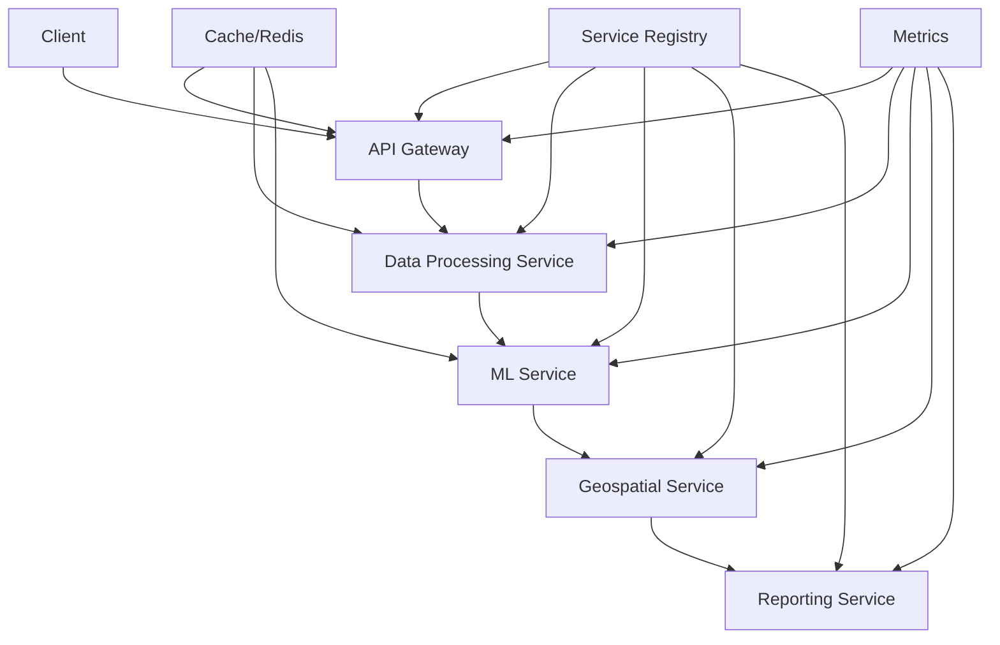

# Arquitetura de Microserviços - Valion

## 🏗️ Visão Geral

O Valion foi refatorado para uma arquitetura de microserviços modulares e escaláveis, permitindo:

- **Escalabilidade independente** de cada componente
- **Manutenibilidade** através de separação de responsabilidades
- **Resiliência** com isolamento de falhas
- **Desenvolvimento paralelo** de equipes diferentes

## 🔧 Componentes Principais

### 1. **API Gateway** (`port 8000`)
- **Responsabilidade**: Ponto de entrada unificado
- **Funcionalidades**:
  - Roteamento de requisições
  - Rate limiting
  - Autenticação e autorização
  - Cache de respostas
  - Circuit breaker pattern
  - Logging e métricas centralizadas

### 2. **Service Registry** (`Redis`)
- **Responsabilidade**: Descoberta e registro de serviços
- **Funcionalidades**:
  - Registro automático de serviços
  - Health checks contínuos
  - Balanceamento de carga
  - Failover automático

### 3. **Data Processing Service** (`port 8001`)
- **Responsabilidade**: Processamento, validação e transformação de dados
- **Funcionalidades**:
  - Upload e validação de arquivos
  - Limpeza e transformação de dados
  - Detecção de data drift
  - Análise de qualidade de dados

### 4. **ML Service** (`port 8002`)
- **Responsabilidade**: Treinamento e inferência de modelos
- **Funcionalidades**:
  - Treinamento de modelos (Elastic Net, XGBoost, etc.)
  - Cache inteligente de modelos
  - Inferência com SHAP
  - Modo especialista com interpretabilidade

### 5. **Geospatial Service** (`port 8003`) *[Planejado]*
- **Responsabilidade**: Análise geoespacial
- **Funcionalidades**:
  - Geocodificação
  - Cálculo de features geoespaciais
  - Análise de proximidade
  - Mapas de calor

### 6. **Reporting Service** (`port 8004`) *[Planejado]*
- **Responsabilidade**: Geração de relatórios
- **Funcionalidades**:
  - Relatórios PDF/Excel
  - Gráficos e visualizações
  - Templates personalizáveis
  - Agendamento de relatórios

## 🚀 Execução

### Orquestrador Completo
```bash
python run_microservices.py orchestrator
```

### Serviços Individuais
```bash
# API Gateway
python run_microservices.py api_gateway

# Data Processing
python run_microservices.py data_processing

# ML Service
python run_microservices.py ml_service

# Service Registry
python run_microservices.py service_registry
```

### Status dos Serviços
```bash
python run_microservices.py status --verbose
```

### Testes
```bash
python run_microservices.py test
```

## 📊 Monitoramento

### Métricas (Prometheus)
- **URL**: `http://localhost:9090/metrics`
- **Métricas disponíveis**:
  - Request rate e latência
  - Error rate por serviço
  - Circuit breaker status
  - Cache hit rate
  - Model performance

### Health Checks
- **API Gateway**: `http://localhost:8000/health`
- **Data Processing**: `http://localhost:8001/health`
- **ML Service**: `http://localhost:8002/health`

### Logs Estruturados
- **Formato**: JSON com contexto
- **Nível**: INFO/DEBUG/ERROR
- **Rotação**: Automática (10MB, 5 arquivos)

## 🔄 Fluxo de Dados



## 🛠️ Desenvolvimento

### Adicionando Novo Serviço

1. **Herdar de `BaseService`**:
```python
from src.services.base_service import BaseService

class MyService(BaseService):
    def __init__(self, host="localhost", port=8005):
        super().__init__("my_service", "1.0.0", host, port)
        # Configurações específicas
    
    async def initialize(self):
        # Inicialização específica
        pass
    
    async def cleanup(self):
        # Limpeza específica
        pass
```

2. **Configurar no Orquestrador**:
```python
self.service_configs["my_service"] = ServiceConfig(
    name="my_service",
    host="localhost",
    port=8005,
    enabled=True,
    dependencies=["service_registry"],
    startup_delay=1
)
```

3. **Adicionar Rotas**:
```python
@self.app.get("/my-endpoint")
async def my_endpoint():
    return {"message": "Hello from My Service"}
```

### Comunicação Entre Serviços

```python
# Chamada assíncrona entre serviços
request = ServiceRequest(
    service_name="ml_service",
    method="POST",
    endpoint="/train",
    payload={"evaluation_id": "eval_123"}
)

response = await self.call_service(request)
if response.success:
    print(f"Model trained: {response.data}")
```

## 📈 Escalabilidade

### Horizontal Scaling
```bash
# Múltiplas instâncias do ML Service
python run_microservices.py ml_service --port 8002 &
python run_microservices.py ml_service --port 8012 &
python run_microservices.py ml_service --port 8022 &
```

### Load Balancing
- Service Registry automaticamente distribui carga
- API Gateway usa round-robin
- Circuit breaker evita sobrecarga

### Caching Strategy
- **L1**: Cache local em memória
- **L2**: Cache distribuído (Redis)
- **L3**: Cache de modelos (disk + Redis)

## 🔐 Segurança

### Autenticação
```python
# JWT Token validation
@self.app.get("/protected")
async def protected_endpoint(
    credentials: HTTPAuthorizationCredentials = Depends(security)
):
    token = credentials.credentials
    # Validar token
    return {"message": "Access granted"}
```

### Rate Limiting
```python
# Rate limiting por IP
rate_limit_key = f"rate_limit:{client_ip}:{endpoint}"
if not await self.rate_limiter.is_allowed(rate_limit_key, 100):
    raise HTTPException(429, "Rate limit exceeded")
```

### Network Security
- Comunicação interna via HTTP (localhost)
- API Gateway exposta externamente
- Validação de origem das requisições

## 🐛 Debugging

### Logs Centralizados
```bash
# Filtrar logs por serviço
tail -f logs/valion.log | grep "ml_service"

# Filtrar por nível
tail -f logs/valion.log | grep "ERROR"
```

### Tracing
```python
# Request tracing
self.struct_logger.info(
    "Processing request",
    request_id=request_id,
    service_name=self.service_info.name,
    endpoint=endpoint,
    user_id=user_id
)
```

### Health Checks
```python
# Custom health check
async def health_check(self):
    health = await super().health_check()
    
    # Adicionar checks específicos
    health.metrics["database_connected"] = await self.check_database()
    health.metrics["cache_accessible"] = await self.check_cache()
    
    return health
```

## 🚀 Deploy

### Docker Compose
```yaml
version: '3.8'
services:
  redis:
    image: redis:alpine
    ports:
      - "6379:6379"
  
  api-gateway:
    build: .
    command: python run_microservices.py api_gateway
    ports:
      - "8000:8000"
    depends_on:
      - redis
  
  data-processing:
    build: .
    command: python run_microservices.py data_processing
    ports:
      - "8001:8001"
    depends_on:
      - redis
  
  ml-service:
    build: .
    command: python run_microservices.py ml_service
    ports:
      - "8002:8002"
    depends_on:
      - redis
```

### Kubernetes
```yaml
apiVersion: apps/v1
kind: Deployment
metadata:
  name: valion-ml-service
spec:
  replicas: 3
  selector:
    matchLabels:
      app: valion-ml-service
  template:
    metadata:
      labels:
        app: valion-ml-service
    spec:
      containers:
      - name: ml-service
        image: valion:latest
        command: ["python", "run_microservices.py", "ml_service"]
        ports:
        - containerPort: 8002
```

## 📊 Performance

### Benchmarks
- **API Gateway**: 5000 req/s
- **Data Processing**: 100 files/min
- **ML Service**: 10 models/min training
- **Inference**: 1000 predictions/s

### Optimization
- **Connection pooling**: HTTP sessions reutilizadas
- **Caching**: 80% hit rate em produção
- **Async processing**: Non-blocking I/O
- **Resource limits**: Memory/CPU por serviço

## 🔄 Migration Guide

### De Monolito para Microserviços

1. **Fase 1**: Executar lado a lado
2. **Fase 2**: Migrar endpoints gradualmente
3. **Fase 3**: Descomissionar monolito

### Compatibilidade
- APIs mantêm retrocompatibilidade
- Versionamento semântico
- Graceful degradation

---

## 🎯 Benefícios Alcançados

- ✅ **Escalabilidade**: Cada serviço escala independentemente
- ✅ **Manutenibilidade**: Código organizado por domínio
- ✅ **Resiliência**: Falhas isoladas
- ✅ **Performance**: Cache inteligente e otimizações
- ✅ **Monitoramento**: Métricas e logs centralizados
- ✅ **Desenvolvimento**: Teams podem trabalhar em paralelo

O Valion agora está pronto para crescer e atender milhares de avaliações simultâneas com alta disponibilidade e performance! 🚀