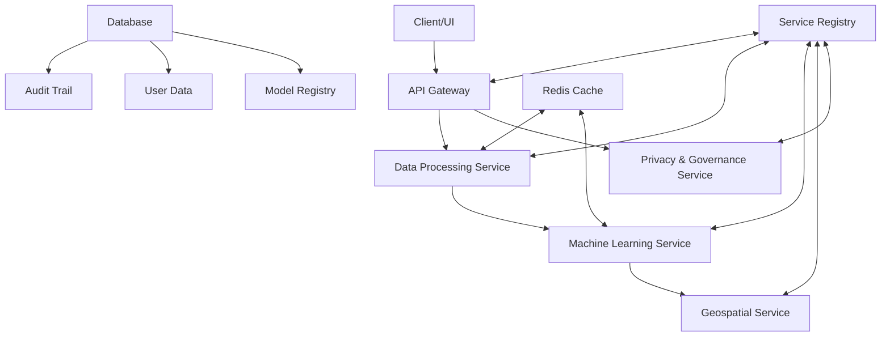

# Valion - Global AI-Powered Real Estate Valuation Platform

**The world's most comprehensive property valuation engine designed for simultaneous compliance with 7 major international standards: NBR 14653 (Brazil), USPAP (USA), EVS (Europe), RICS Red Book (UK/Commonwealth), IVS (International), CUSPAP (Canada), and API (Australia). A "Glass-Box" solution that transforms property appraisal from a time-consuming process into a transparent, auditable, and instantaneous analysis.**

[](https://github.com/tjsasakifln/Valion/blob/main/LICENSE)
[](https://www.python.org/downloads/)
[](MICROSERVICES.md)
[](MLOPS_PIPELINE.md)
[](https://shap.readthedocs.io/)

## 🎯 The Strategic Opportunity: A Global Compliance Engine

Property valuation is a critical function, yet it is highly fragmented by jurisdiction. Valion solves this challenge head-on, offering a multinational institution the ability to unify its valuation operations, drastically reducing operational complexity, costs, and regulatory risk.

The global PropTech market is projected to grow from ~$40 billion in 2024 to $88 billion by 2032, and the adoption of Automated Valuation Models (AVMs) is being driven by regulatory mandates, especially in Europe.

**Valion is not just another AVM; it is a strategic risk management and compliance solution on a global scale.**

## ✨ Key Capabilities

| Category | Core Feature | Business Benefit |
| :--- | :--- | :--- |
| 🤖 **AI-Powered Valuation** | "Glass-Box" models with SHAP | Delivers full transparency and auditability, eliminating "black-box" risk. |
| 🌍 **Global Compliance** | Native support for 7 international standards | Unifies global operations across all major valuation jurisdictions, reducing regulatory risk and operational overhead. |
| 🏗️ **MLOps & Microservices** | Complete MLOps Pipeline & Scalable Architecture | Enterprise-ready for production, ensuring reliability, scalability, and agile maintenance. |
| 🗺️ **Geospatial Intelligence** | POI, Accessibility, & Cluster Analysis | Generates powerful location-based features that increase accuracy and provide market insights. |
| ⚡ **Interactive Analysis** | SHAP Laboratory & Dynamic Reporting | Enables users to simulate scenarios and understand the real-world impact of each property feature. |
| 🔒 **Privacy & Governance** | GDPR Compliance & Data Anonymization | Comprehensive data governance with audit trails, user data export/deletion, and privacy controls. |

## 🏗️ Enterprise-Ready Microservices Architecture

Valion is built on a robust and scalable microservices architecture, designed for demanding production environments.



## 🚀 Quick Start (Docker Deployment)

The fastest and most reliable way to run the complete Valion platform.

1.  **Clone the repository:**
    ```bash
    git clone https://github.com/tjsasakifln/Valion.git
    cd Valion
    ```
2.  **Set up the environment file:**
    ```bash
    cp .env.example .env
    ```
3.  **Launch the services:**
    ```bash
    docker-compose up --build
    ```

**Platform Endpoints:**
* **Main Interface:** `http://localhost:8501`
* **API Documentation:** `http://localhost:8000/docs`
* **Task Monitor (Flower):** `http://localhost:5555`

## 🌍 International Valuation Standards Compliance

### NBR 14653 (Brazil) - Precision Levels

| Grade | Minimum R² | Description |
|-------|------------|-------------|
| **Superior** | ≥ 0.90 | Excellent explanatory capacity |
| **Normal** | ≥ 0.80 | Good explanatory capacity |
| **Inferior** | ≥ 0.70 | Adequate explanatory capacity |
| **Inadequate** | < 0.70 | Insufficient explanatory capacity |

### USPAP (United States) - Compliance Framework

| Standard | Validation | Description |
|----------|------------|-------------|
| **Methodology Defense** | Statistical rigor | Defensible valuation methodology |
| **Market Analysis** | Adequacy testing | Comprehensive market data analysis |
| **Reasonableness** | Result validation | Logical and supportable conclusions |

### EVS (Europe) - Valuation Standards

| Criterion | Assessment | Description |
|-----------|------------|-------------|
| **Market Value** | Basis evaluation | European market value principles |
| **Sustainability** | Environmental factors | ESG considerations in valuation |
| **Transparency** | Process clarity | Clear valuation process documentation |

### RICS Red Book (UK/Commonwealth) - Professional Standards

| Standard | Validation | Description |
|----------|------------|-------------|
| **Market Value Basis** | Clear market definition | Unambiguous basis for market value determination |
| **Professional Competence** | Methodology quality | Adherence to professional valuation practices |
| **Due Diligence** | Accuracy requirements | MAPE ≤ 20% for professional standards |
| **Reporting Clarity** | Transparency score | Clear and interpretable valuation results |

### IVS (International) - Global Standards

| Criterion | Assessment | Description |
|-----------|------------|-------------|
| **Bases of Value** | Market value compliance | Consistency with international market value concepts |
| **Valuation Approaches** | Methodology alignment | Adherence to market, income, or cost approaches |
| **International Consistency** | R² ≥ 0.65 | Meeting international accuracy standards |
| **Transparency** | Methodology disclosure | Clear documentation of valuation process |

### CUSPAP (Canada) - Professional Practice

| Standard | Validation | Description |
|----------|------------|-------------|
| **Credible Results** | R² ≥ 0.70, MAPE ≤ 15% | High accuracy standards for credible assignments |
| **Professional Competency** | Model selection quality | Use of established, transparent methodologies |
| **Canadian Market Relevance** | Feature appropriateness | Integration of Canadian market characteristics |
| **Unbiased Analysis** | Systematic bias ≤ 5% | Ethical standards for unbiased valuation |

### API (Australia) - Property Institute Standards

| Criterion | Assessment | Description |
|-----------|------------|-------------|
| **Australian Market Evidence** | Local feature integration | Comprehensive Australian market data |
| **Professional Practice** | Methodology standards | Adherence to API professional guidelines |
| **Valuation Accuracy** | R² ≥ 0.75, MAPE ≤ 12% | High precision requirements |
| **Regulatory Compliance** | Australian requirements | Compliance with local regulatory framework |

## 🔬 Glass-Box AI Technology

### Explainable AI Models
- **Standard Mode**: Elastic Net Regression (L1 + L2 regularization)
- **Expert Mode**: XGBoost, Random Forest, Gradient Boosting
- **Validation**: 5-fold cross-validation with stability analysis
- **Interpretability**: SHAP (SHapley Additive exPlanations) values with interactive laboratory

### Interactive SHAP Laboratory
- **Real-time Simulation**: Adjust property features and see instant SHAP impact
- **Waterfall Charts**: Visual breakdown of each prediction component
- **Feature Importance**: Permutation-based and SHAP-based rankings
- **Glass-Box Analysis**: Complete transparency in AI decision-making

## 🚀 MLOps Pipeline

### Model Lifecycle Management
- **Model Registry**: Centralized versioning with semantic versioning (Major.Minor.Patch)
- **Model Validation**: Automated validation with 5 built-in validators (Performance, Data Drift, Stability, Bias, Data Quality)
- **Model Deployment**: Multiple deployment strategies (Blue-Green, Canary, Rolling, Replace)
- **Pipeline Orchestration**: Automated ML pipelines with dependency management and retry logic

### Deployment Strategies
- **Blue-Green**: Zero-downtime deployment with instant rollback
- **Canary**: Gradual rollout with traffic splitting and monitoring
- **Rolling**: Incremental updates with health checks
- **Replace**: Simple deployment for development environments

## 🔒 Privacy & Data Governance

### GDPR Compliance Features
- **Right of Access**: Complete user data export functionality
- **Right to be Forgotten**: Secure data deletion with confirmation tokens
- **Data Anonymization**: Statistical integrity-preserving anonymization
- **Audit Trail**: Immutable logging of all data access and operations
- **Privacy Dashboard**: Compliance monitoring and reporting tools

### Security Measures
- **Multi-tenant Architecture**: Isolated data access per organization
- **Role-based Access Control**: Granular permissions system
- **PII Access Tracking**: Comprehensive logging of sensitive data access
- **Data Encryption**: Secure storage and transmission of sensitive information

## 🗺️ Geospatial Intelligence

### Multi-Region Support
- **Brazil**: Complete POI database with transport accessibility (Metro, Bus, Train)
- **United States**: Comprehensive location analysis with market clustering (Subway, Bus, Light Rail)
- **Europe**: Regional compliance with environmental sustainability factors (Metro, Bus, Tram, Train)
- **United Kingdom**: London-centered analysis with British transport systems (Tube, Bus, Train)
- **Canada**: Toronto-centered with Canadian transport infrastructure (Subway, Bus, Streetcar)
- **Australia**: Sydney-centered with Australian transport networks (Train, Bus, Ferry)
- **International**: Global neutral configuration for cross-border portfolios

### Advanced Location Analytics
- **POI Scoring**: Automated scoring of nearby amenities and services
- **Transport Accessibility**: Public and private transport connectivity analysis
- **Neighborhood Clustering**: Automated classification (Premium Central, Urban Consolidated, etc.)
- **Distance Analysis**: Proximity-based feature engineering
- **Heatmap Visualization**: Interactive geographical value mapping

## 📈 Performance & Monitoring

### Real-time Metrics
- **Prometheus Integration**: Custom metrics and performance monitoring
- **Data Drift Detection**: KS tests, PSI calculations, and anomaly detection
- **Performance Tracking**: Model accuracy, latency, and throughput monitoring
- **Structured Logging**: JSON-formatted logs with correlation IDs

### Intelligent Caching
- **Multi-layer Caching**: 60-80% performance improvement
- **Adaptive Algorithms**: Dynamic cache optimization
- **Enterprise Scale**: Production-ready caching strategies

## 🎯 Business Use Cases

### Enterprise Applications
- **🏢 Financial Institutions**: Automated loan underwriting and collateral evaluation
- **🏗️ Property Developers**: AI-powered market analysis and feasibility studies
- **💼 Investment Firms**: Portfolio valuation and risk assessment
- **🏛️ Government Agencies**: Regulatory compliance and tax assessment
- **🏘️ Property Management**: Bulk portfolio valuation and optimization

### Global Market Applications
- **🇧🇷 Brazilian Market**: NBR 14653 compliance with local POI database
- **🇺🇸 US Market**: USPAP-compliant methodology with comprehensive analysis
- **🇪🇺 European Market**: EVS standards with sustainability considerations
- **🇬🇧 UK/Commonwealth Markets**: RICS Red Book compliance with professional standards
- **🌐 International Markets**: IVS standards for cross-border consistency
- **🇨🇦 Canadian Market**: CUSPAP compliance with Canadian market specifics
- **🇦🇺 Australian Market**: API standards with local regulatory compliance
- **🌍 Global Portfolios**: Multi-standard support for multinational operations

## 📋 API Reference

### Core Endpoints

| Method | Endpoint | Description |
|--------|----------|-------------|
| `POST` | `/evaluations/` | Start new evaluation |
| `GET` | `/evaluations/{id}` | Get evaluation status |
| `GET` | `/evaluations/{id}/result` | Retrieve evaluation results |
| `POST` | `/evaluations/{id}/predict` | Make predictions |
| `POST` | `/upload` | Upload data files |

### Privacy & Governance

| Method | Endpoint | Description |
|--------|----------|-------------|
| `GET` | `/privacy/report` | Generate privacy compliance report |
| `GET` | `/privacy/pii-access-log` | View PII access logs |
| `POST` | `/privacy/export-user-data` | Export user data (GDPR) |
| `POST` | `/privacy/delete-user-data` | Delete user data (GDPR) |
| `GET` | `/privacy/my-activity` | Personal activity logs |

### MLOps Endpoints

| Method | Endpoint | Description |
|--------|----------|-------------|
| `GET` | `/models/` | List all models |
| `POST` | `/models/` | Register new model |
| `POST` | `/models/{id}/deploy` | Deploy model |
| `GET` | `/deployments/` | List deployments |
| `POST` | `/pipelines/execute` | Execute ML pipeline |

📖 **Interactive Documentation**: http://localhost:8000/docs

## 🛡️ Security & Compliance

### Security Features
- Input validation and sanitization
- SQL injection prevention
- XSS protection with Content Security Policy
- Rate limiting and DDoS protection
- Secure file upload handling
- Comprehensive audit logging

### Compliance Standards
- **GDPR**: Complete data governance and privacy controls
- **ISO 27001**: Security management best practices
- **SOC 2**: Operational security controls
- **Multi-jurisdictional**: Support for global regulatory requirements

## 🚀 Deployment & Production

### Production-Ready Features
- **Zero-downtime Deployments**: Blue-Green deployment strategy
- **Health Monitoring**: Kubernetes-compatible health checks
- **Observability**: Prometheus/Grafana integration
- **Error Tracking**: Comprehensive error monitoring
- **Scalability**: Horizontal scaling capabilities

### Docker Deployment
```bash
# Production deployment
ENVIRONMENT=production docker-compose up -d

# Monitoring stack
docker-compose -f docker-compose.yml -f docker-compose.monitoring.yml up -d
```

## 🧪 Testing & Quality Assurance

### Comprehensive Testing Suite
```bash
# Run all tests
pytest

# Run with coverage report
pytest --cov=src --cov-report=html

# Run MLOps pipeline demonstration
python demo_mlops_pipeline.py

# Run microservices
python run_microservices.py orchestrator
```

### Quality Metrics
- **Code Coverage**: >90% test coverage
- **Performance Tests**: Load testing with realistic scenarios
- **Security Scans**: Automated vulnerability assessments
- **Compliance Validation**: Regulatory standard verification

## 📄 License & Commercial Use

This project is licensed under the **Business Source License 1.1** (BSL-1.1).

* ✅ **Free for development, testing, and non-production use**.
* ⚠️ **Commercial and production use require express written consent**.

The license will automatically convert to Apache 2.0 on **2029-07-17**.

**Interested in bringing Valion to production or discussing a strategic acquisition?**

Please get in touch to discuss commercial licensing and partnership opportunities.

📧 **Contact:** tiago@confenge.com.br

---

<div align="center">

**🏠 Valion** - *Global AI-Powered Real Estate Valuation Platform*

*The world's most comprehensive multi-standard compliance engine for multinational property valuation operations*

Made with precision for enterprise real estate professionals worldwide

[⭐ Star this repo](https://github.com/tjsasakifln/Valion) | [🐛 Report Issues](https://github.com/tjsasakifln/Valion/issues) | [💡 Request Features](https://github.com/tjsasakifln/Valion/discussions) | [📧 Commercial Inquiries](mailto:tiago@confenge.com.br)

**Enterprise Tags**: #RealEstate #PropTech #AI #Compliance #GlobalValuation #MLOps #EnterpriseAI #PropertyTech

</div>